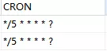

## SpringBoot下实现Scheduled定时任务个性化配置
### 1、需求概述：
后台页面提供给用户可配置化的定时任务功能，用户可以新增、编辑、暂停、开启、删除定时任务。用户新增时输入的内容作为执行定时任务的条件，去数据库捞取数据。用户设置的时间为定时任务执行的时间，每新增一条信息即产生一条新的定时任务。
### 2、简单分析：
a.用户新增定时任务，将执行条件、任务触发时间等信息保存到数据库；并开启该条定时任务；

b.用户修改定时任务，更新数据库，重新开启该条定时任务；

c.项目启动时，要扫描数据库定时任务信息，并将任务添加至定时任务组件中，开启它；
### 3、技术点：
一般我们都是从xml配置或者注解中读取定时任务配置，而现在需要用代码来实现它。定时任务可配置化就肯定要做持久层处理。
### 4、代码实现：
```
@Component

public class ScheduleConfig {

    @Autowired

    private ThreadPoolTaskScheduler taskScheduler;

    private Map<String, ScheduledFuture<?>> futureMap = new HashMap<>();

    private String cron = "";

    /**

    * 取消定时任务

    *

    * @param id 任务id

    */

    public void cancelTimedTask(String id) {

        if (futureMap.get(id) != null) {

            //取消定时任务

            futureMap.get(id).cancel(true);

            futureMap.remove(id);

        }

    }

    /**

    * 新建并开启定时任务

    *

    * @param id  定时任务唯一标识id

    * @param cron 定时任务时间表达式

    * @param task 定时任务task

    */

    public void startTimedTask(String id, String cron, Runnable task) {

        this.cron = cron;

        ScheduledFuture<?> future = taskScheduler.schedule(task, new Trigger() {

            @Override

            public Date nextExecutionTime(TriggerContext triggerContext) {

                if (StringUtils.isEmpty(cron)) {

                    return null;

                }

                // 定时任务触发，可修改定时任务的执行周期

                CronTrigger trigger = new CronTrigger(cron);

                Date nextExecDate = trigger.nextExecutionTime(triggerContext);

                return nextExecDate;

            }

        });

        futureMap.put(id, future);

    }

}
```
笔者这里ThreadPoolTaskScheduler 这个对象因为公司自己的jar包里已经初始化过了，所以直接注入使用了，不然需要初始化使用。

这个里面定时任务表达式cron和task任务类作为两个变量传进来，实现了定时任务可配置化的要求。futureMap 这个map对象用作存储开启定时任务后返回的future，因为后面取消定时任务会需要用到。

String cron, Runnable task两个参数：根据用户设定的执行时间，自己转换成cron表达式，并存入数据库中，具体的任务对象可以定义实现Runnable接口即可。
```
/**
 * 报表模板可配置化任务
 *
 * @author : hejinqiu
 * @date : 2019/3/18
 */
public class TemplateReportTask implements Runnable {

    private static Logger logger = LoggerFactory.getLogger(TemplateReportTask.class);

    private ReportService reportService;

    private TemplateReport templateReport;

    public TemplateReportTask(TemplateReport templateReport) {
        this.templateReport = templateReport;
    }

    @Override
    public void run() {
        //TODO 具体的业务
        System.out.println(templateReport.getTemplateId() + "定时任务执行拉！");
    }
 }
```
上面这个是我的需求所自定义的任务类，run方法里写具体的业务代码 。
至此，定时任务的开启，取消功能其实就已经实现了，停止和取消是一样的。

再贴一下启动的代码，
```
TemplateReportTask templateReportTask = new TemplateReportTask(templateReport);
scheduleConfig.startTimedTask(templateReport.getTemplateId(), templateReport.getCron(), templateReportTask);
logger.info(templateReport.getTemplateId() + "定时任务开启成功");
```
task传你自己定义的任务类即可。

最后还差一个在项目启动的时候，需要去扫描数据库的定时任务配置信息，把符合要求的定时任务都开启即可。项目启动就执行某个方法，实现CommandLineRunner或者ApplicationRunner 接口即可。贴下代码：
```
@Component

public class ReportRunner implements ApplicationRunner {

    private Logger logger = LoggerFactory.getLogger(ReportRunner.class);

    @Autowired

    private ScheduleConfig scheduleConfig;

    @Autowired

    private TemplateReportService templateReportService;

    @Override

    public void run(ApplicationArguments args) throws Exception {

        // 项目启动加载所有报表配置 将定时任务添加至定时任务组件中

        List<TemplateReport> reports = templateReportService.searchByStatus();

        for (TemplateReport templateReport : reports) {

            scheduleConfig.startTimedTask(templateReport.getTemplateId(), templateReport.getCron(),

                            new TemplateReportTask(templateReport));

            logger.info(templateReport.getTemplateId() + "定时任务开启成功");

        }

    }

}
```
下面测试下，数据库存在两条定时任务信息，cron时间表达式暂设每5秒执行一次。




启动项目，看下效果。


至此，Scheduled定时任务可配置化的功能就顺利实现拉！
